# Solar Energy Production Forecasting - Competition

The project description and data can be found on [Kaggle](https://www.kaggle.com/competitions/solar-energy-production-forecasting).

# Solar Datahead Forecast Data

The dataset provides data for evaluating solar production dayahead forecasting methods.
The dataset contains three locations (A, B, C), corresponding to office buildings with solar panels installed.
There is one folder for each location.

There are 4 files in each folder:

1. train_targets.parquet - target values for the train period (solar energy production)
2. X_train_observed.parquet - actual weather features for the first part of the training period
2. X_train_estimated.parquet - predicted weather features for the remaining part of the training period
2. X_test_estimated.parquet - predicted weather features for the test period

Baseline and targets production values have hourly resolution.
Weather has 15 min resolution.
Weather parameter descriptions can be found [here](https://www.meteomatics.com/en/api/available-parameters/alphabetic-list/).

There is a distinction between train and test features.
For training, we have both observed weather data and its forecasts, while for testing we only have forecasts.
While file `X_train_observed.parquet` contains one time-related column `date_forecast` to indicate when the values for the current row apply,
both `X_train_estimated.parquet` and  `X_test_estimated.parquet` additionally contain `date_calc` to indicate when the forecast was produced.
This type of test data makes evaluation closer to how the forecasting methods that are used in production.
Evaluation measure is [MAE](https://en.wikipedia.org/wiki/Mean_absolute_error).

# Our final submission

The total final report with all the code details can be found on [`final_notebook.ipynb`](notebooks/final_notebook.ipynb). This section is only allocated to provides the main plots we had.

On [`rsc`](./rsc) folder we displayed some results after running [`final_notebook.ipynb`](final_notebook.ipynb).

For instance, the data that we had for the three locations were looking like that:
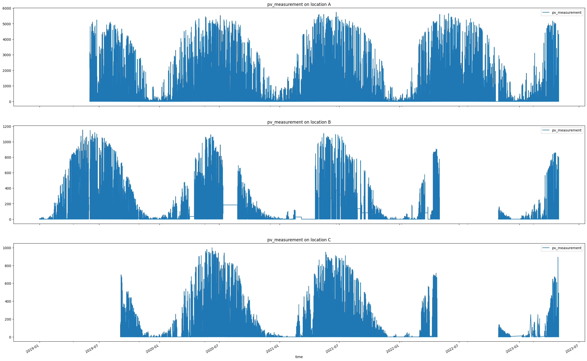

## 1. Data analysis

We noticed a high correlation between the three locations:

`correlation between A and B of pv_measurement: 0.848312308309505
corrélation between A and C of pv_measurement: 0.9257933955622683
corrélation between B and C of pv_measurement: 0.8771619108144573`

We sorted the variables by categories:

|Sun-related variables|Snow-related variables|Atmospheric pressure variables|Rain variables|Wind variables|Cloud-related variables|Visibility and altitude variables|Variables related to diffuse and direct light|Day/night and shade variable|
|--- |:-: |:-: |:-: |:-: |:-: |:-: |:-:   |--:   |
|`clear_sky_energy_1h:J`|`fresh_snow_12h:cm`|`msl_pressure:hPa`|`precip_5min:mm`|`wind_speed_10m:ms`|`effective_cloud_cover:p`|`ceiling_height_agl:m`|`diffuse_rad:W`|`is_day:idx`|
|`clear_sky_rad:W`|`fresh_snow_1h:cm`|`pressure_100m:hPa`|`rain_water:kgm2`|`wind_speed_u_10m:ms`|`total_cloud_cover:p`|`elevation:m`|`diffuse_rad_1h:J`|`is_in_shadow:idx`|
|`sun_azimuth:d`|`fresh_snow_24h:cm`|`pressure_50m:hPa`|`prob_rime:p`|`wind_speed_v_10m:ms`|`relative_humidity_1000hPa:p`|`visibility:m`|`direct_rad:W`||
|`sun_elevation:d`|`fresh_snow_3h:cm`|`sfc_pressure:hPa`|`precip_type_5min:idx`||`absolute_humidity_2m:gm3`||`direct_rad_1h:D`||
|`sun_elevation:d`|`fresh_snow_6h:cm`|`t_1000hPa:K`|`dew_or_rime`||`air_density_2m:kgm3`||||
||`snow_density:kgm3`|`wind_speed_w_1000hPa:ms`|`dew_point_2m`||`cloud_base_agl:m`||||
||`snow_depth:cm`||||||||
||`snow_drift:idx`||||||||
||`snow_melt_10min:mm`||||||||
||`snow_water:kgm2`||||||||
||`super_cooled_liquid_water:kgm2`||||||||

We also noticed some strong depedencies between the different inputs:

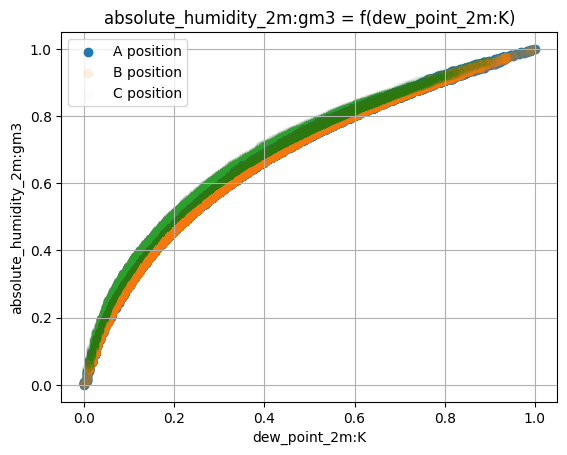
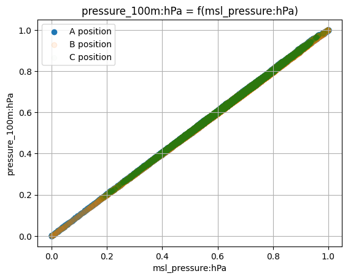
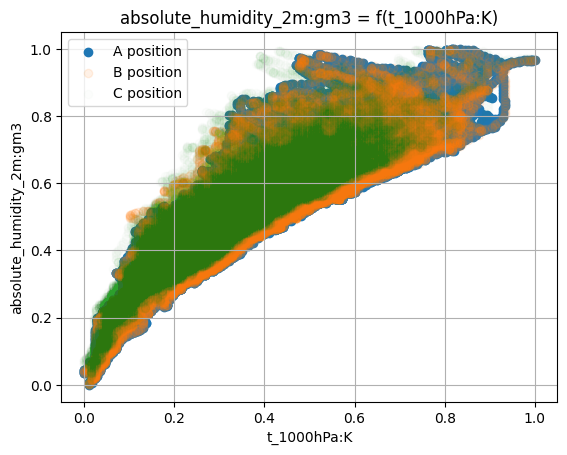
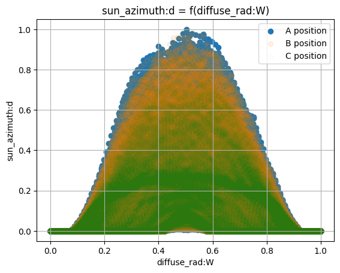

Hence we looked to some correlation matrix:

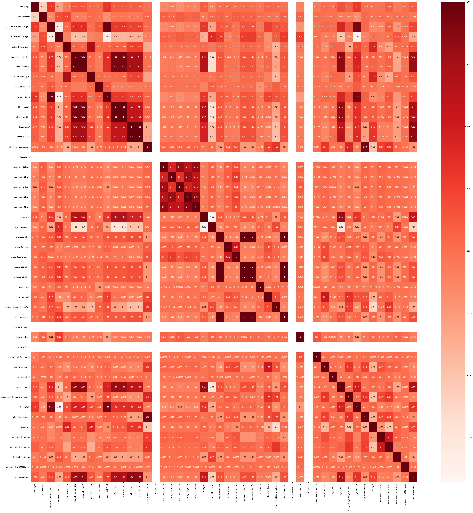

## 2. Signal analysis based models

Because our data were presenting some periodicities, intuitively, one of our first idea were to analyse the different signals we have, starting by our target, `pv_measurement`.

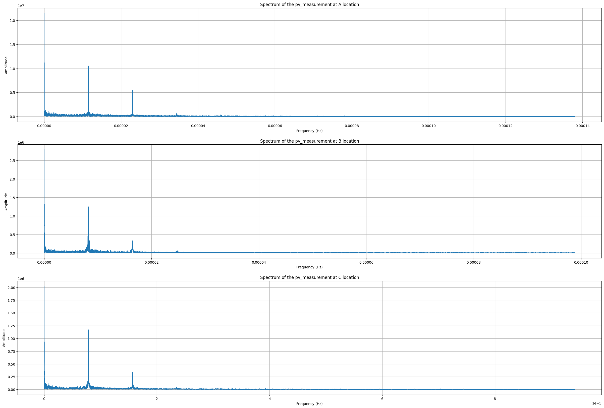
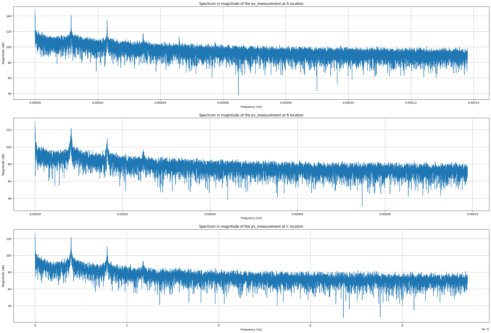

We know from the analysis of the nan values that A got the most clean datas in term of `pv_measurement` values. So our analysis will mostly be based on what we see on A. We can notice 3 most important frequencies: one for the year, one for the day and one for a half-day (12 hours). If we look more on the frequency plot, we can notice a most little one frequency (that our threshold impeach us to read it on the last print). This seems to be a peak for a period of 8 hours, according to the code cell bellow.

Because B and C are not much clean, we can suppose that the big differencies we found with A comes from the Nan values, which create some empty cells in these frames, which are compensated by increasing the frequency values. However, we did not pay attention to it much at first be because most of our analysis were based on A data.

We can confirm what we sayied on B and C compared to A if we look on the differents sampling rates depending on the situation. Theorically, it should be close to one hour ($=3600$ seconds) because our values are measured every hours. But if we look on `1 / sampling_rates['B']` and `1 / sampling_rates['C']` we see that it's more than it for B and C locations. This comes from Nan values and confirms our point above.

We can notice that `1 / sampling_rates['B']` is a bit bigger than an hour. We can explain it by the gap of one week between `X_train_observed_a` and `X_train_estimated_a`, which exists as well in `train_a`.

Now the idea is to keep only the most important frequencies in order to have a model which can be written like this:
$$y[n] = \hat{y}[n] + r[n]$$

where $n$ is the index of the output, $y[n]$ is the real value of `pv_measurement` at index $n$ (or time $t$), $\hat{y}[n]$ is the value at index $n$ of the signal filtered predicted by signal analysis and $r[n]$ is the value at index $n$ of the noise created by mostly, the weather, from our inputs `X_train_estimated`, `X_train_observed`, etc. It would be design by a machine learning model. Actually we did not had the time to test this feature entirely, because of a lack of time our goals priotization. So, it is not entirely designed, but we will detail as far as we came to it.

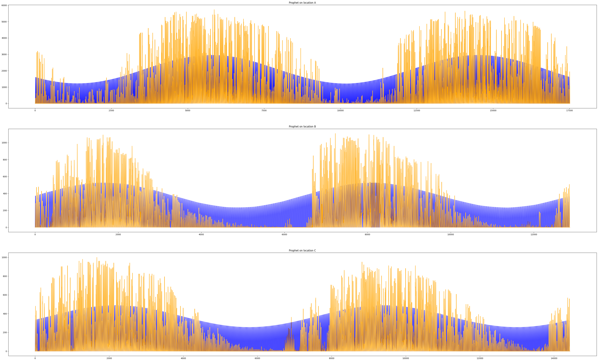

However, we explored different ways to design $\hat{y}[n]$. The first one is a raw filter on the whole signal. This method were not much efficient. In our researchs we found `prophet`, a Python (and R) library which gives a procedure for forecasting time series data based on an additive model where non-linear trends are fit with yearly, weekly, and daily seasonality, plus holiday effects. It works best with time series that have strong seasonal effects and several seasons of historical data. Prophet is robust to missing data and shifts in the trend, and typically handles outliers well.

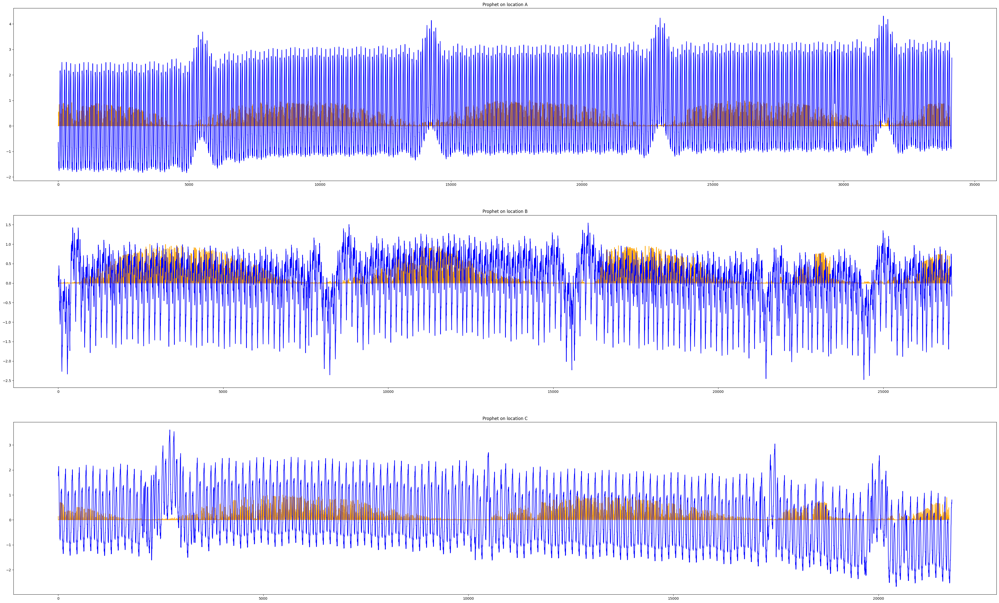

This results, from prophet and the filter signal, are not really satisfying. Then came the idea, inpired by [this paper](https://peerj.com/preprints/3190.pdf), to see what's happen if we plot one signal for each hour (it would make $24 * 3 = 72$ models). We then first split our signals by hours and plot what we get with prophet prediction and our filter.

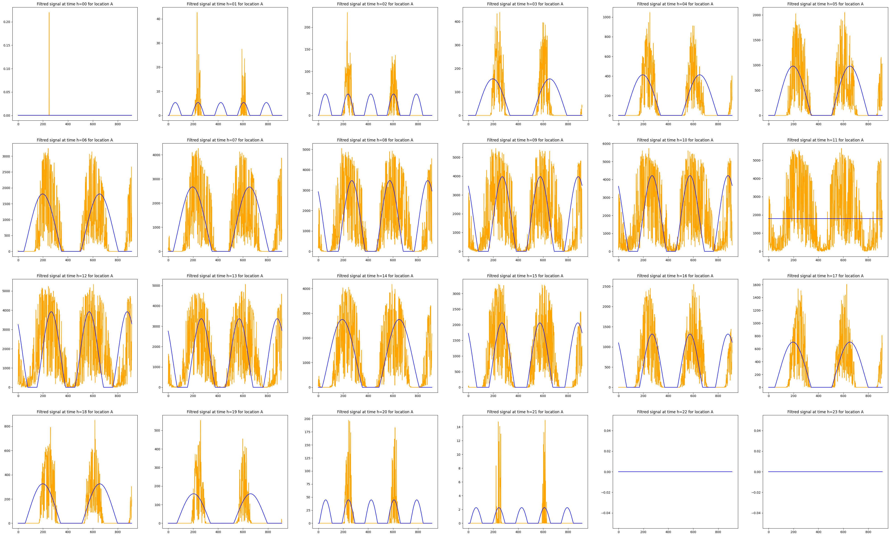
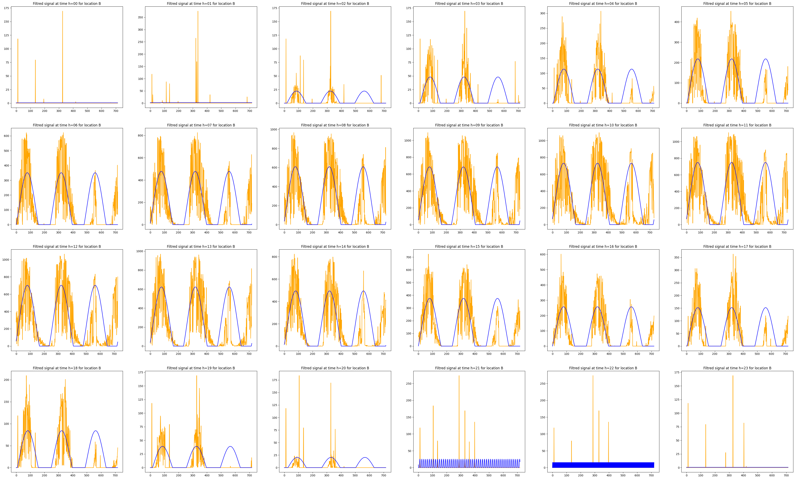
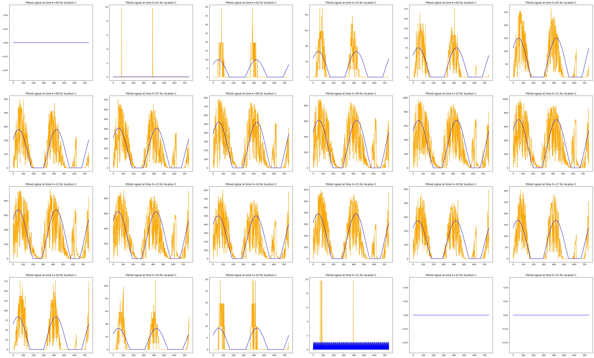

We then reconstructed the whole signals:

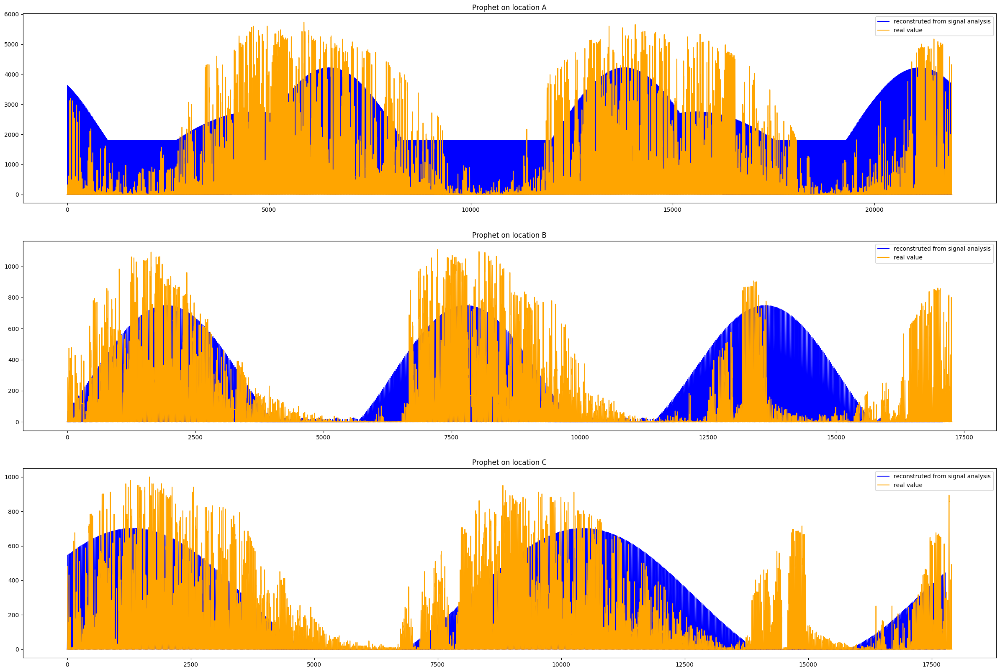

We get here a far more satisfying result. There is a problem for A, we did not get why the curve does not go to 0 value.

We then decided to use the same method using prophet.

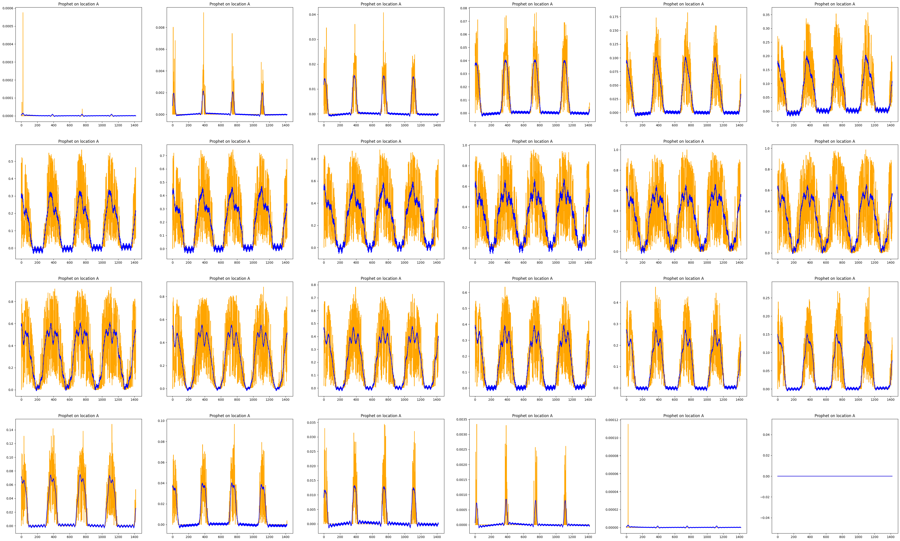
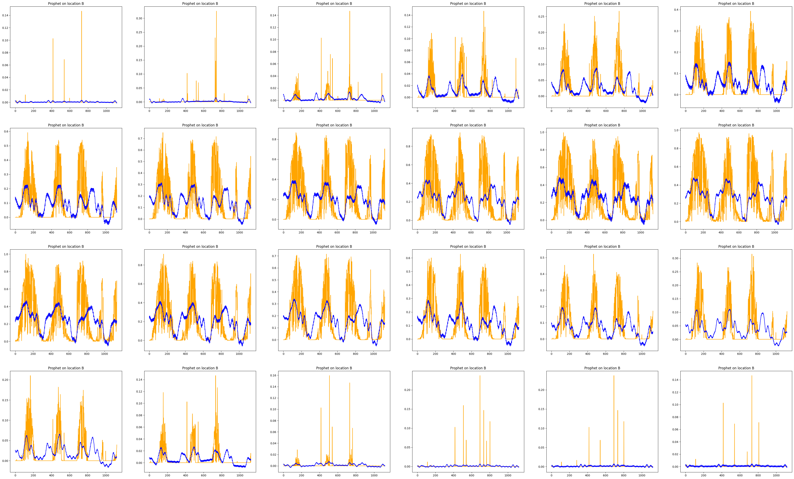
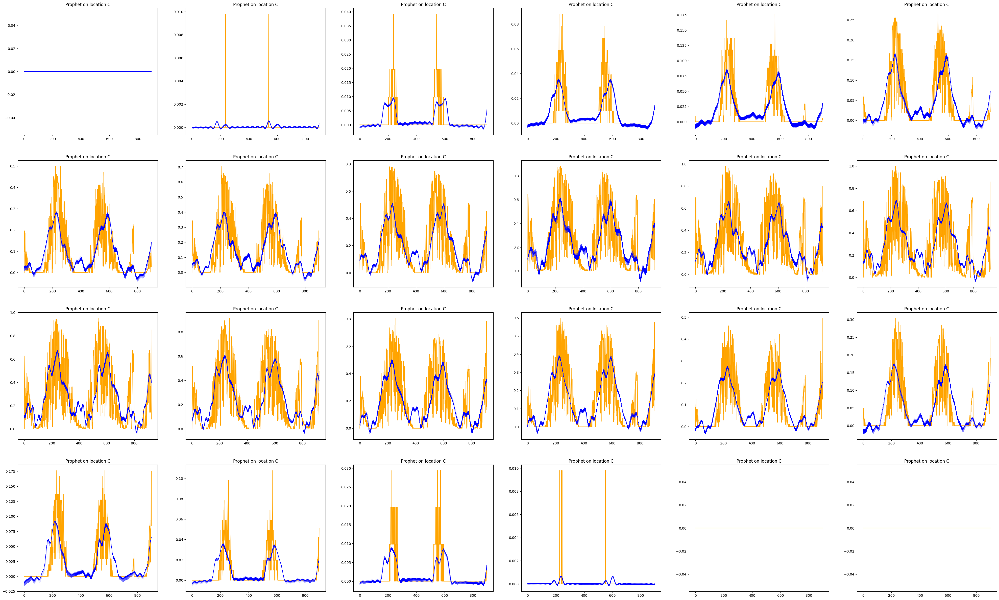

We get then the prophet reconstructions:

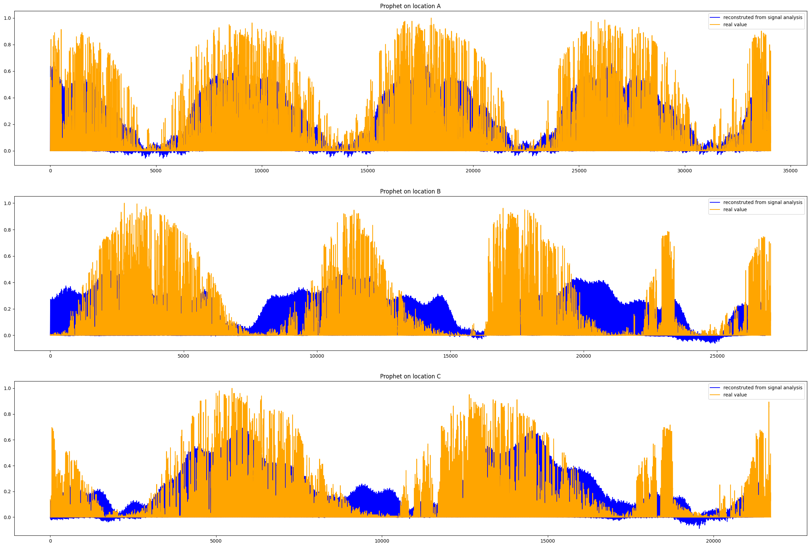

We did not found much successful results on it. The curve obtained were not that bad but we did not had much time to merge this with the biggest model. Maybe this approach were to much complicated as a first one and we should have focus on it later. From now, we consider it as a way to upgrade our current model that we are going to present in the next parts.

### 3. Preprocessing

During our study, we explored many ways to pre-process our inputs. Some were compatible to each other, some were not. We are going to present in this part, some we did as pre-process and those we used. All of them are presented in [`final_notebook.ipynb`](final_notebook.ipynb).

### Feature Engineering

Our data is made up of many features.

**Creating Features**:

As for the `date_forecast` feature. We saw during the signal processing analysis that this feature contains events that repeat at given periods (years/days), so we're going to split our feature into several sub-features to try and obtain relationships with the target.

We therefore separate according to: *hours, day of the week, season, month, year, day of the year and day of the month*.

In order to take into consideration the difference between *observed* and *estimated*, we can add a feature which represent the delay between the prediction and the reality of the weather. We will compute it by calculate the difference between `date_calc` and `date_forecast`.

**Modification of Features**:

When we explore our data we can see that `sun_azimuth:d` corresponds to the position of the sun in degrees. So we can see that 0 and 360 correspond to the same thing. So we're going to transform this feature using a cosine to make it continuous and consistent with what it represents.

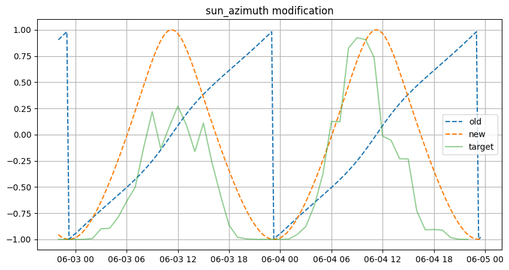

**Data augmentation - interpolation**:

One of our idea, which worked pretty well, was to interpolate the values of the output. We tryed different interpolations, but the one which looked as the best one to do so, were the linear one. It's mathically defined as following, and the function which do the job, is `interpolate_output_values`.
$$y(t + 1/4) = 0.75 * y(t) + 0.25 * y(t+1)$$
$$y(t + 1/2) = 0.5 * y(t) + 0.5 * y(t+1)$$
$$y(t + 3/4) = 0.25 * y(t) + 0.75 * y(t+1)$$
where t is a round hour (such as 12:00:00, 13:00:00 etc).

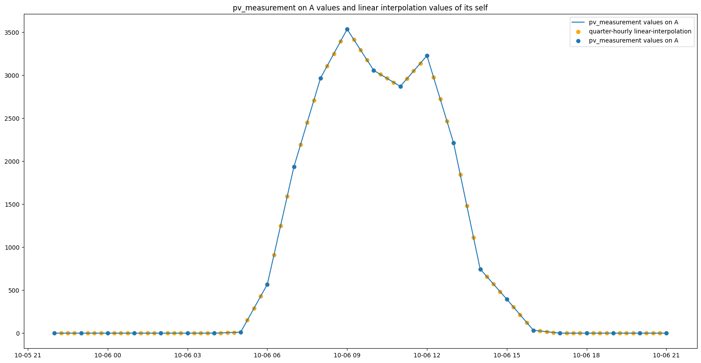

## 3. Models

To simplify the reading of our study, we will only detail our results for location A.

What's more, A has the highest target values (4 to 5 times higher than B and C), which gives us a good idea of the trend to follow.

### 3.1 Model Comparison

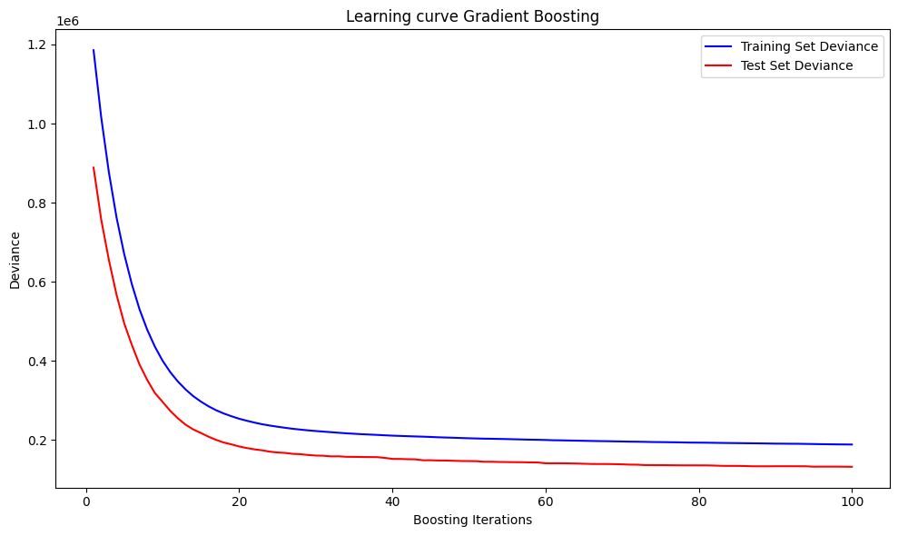

Random Forest MSE: 135010.0
Gradient Boosting MSE: 132579.0
XGBoost MSE: 122446.0

Random Forest MAE: 145.78
Gradient Boosting MAE: 162.04
XGBoost MAE: 142.23

With these first results, we can see that the models have converged well (see learning curves above). We first chose to train our models using RMSE, as it allows us to take better account of outliers (if we look at the distribution of pv_measurement we see that values can reach large values, but quite rarely).

In the evaluation phase, we can see that on both measures, the XGBoost model performs much better than the other two models.

In addition to this study, we can look at the relative importance of each variable on the model by plotting the importance graph generated by the "tree" type models.

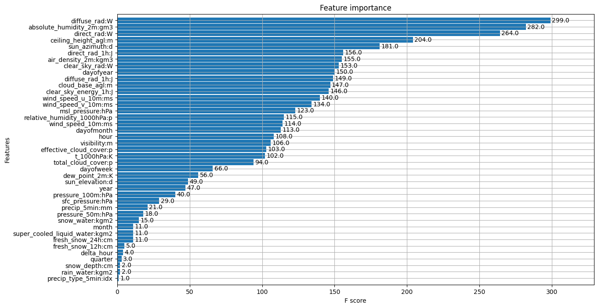

In this ranking, we can see a predominance of 3 variables: `absolute_humidity`,`diffuse_rad`,`direct_rad`.

This seems coherent, as these variables have a direct impact on the sun's rays. As for the radiation variables, these relate directly to sunshine characteristics, which will be proportional to the power generated on the solar panels.

As for humidity, we can deduce that water droplets in the air have a major impact on light transmission and reflection, and therefore on the deduced power generated.

### 3.2 XGBoost hyper-parameters

We thus decided to focus on a XGBoost model, which implies creating models (for A, B and C) with the best hyper-parameters. We thus made the following code in order to find the best hyper-parameters. The thing is, that algorithm has an exponential complexity in terms of the number of hyper-parameters we want to try. 
Thus to make it converge, we were tooking the last best-values, and thus we tryed the neighboors values. And we reapeated it. 

**
 All results:

 Best estimator:
XGBRegressor(base_score=None, booster=None, callbacks=None,
             colsample_bylevel=None, colsample_bynode=None,
             colsample_bytree=0.8, device=None, early_stopping_rounds=None,
             enable_categorical=False, eta=0.005, eval_metric='rmse',
             feature_types=None, gamma=0.5, grow_policy=None,
             importance_type=None, interaction_constraints=None,
             learning_rate=None, max_bin=None, max_cat_threshold=None,
             max_cat_to_onehot=None, max_delta_step=None, max_depth=4,
             max_leaves=None, min_child_weight=17, missing=nan,
             monotone_constraints=None, multi_strategy=None, n_estimators=5000,
             n_jobs=None, num_parallel_tree=None, ...)

 Best hyperparameters:
`{'subsample': 0.6, 'refresh_leaf': 1, 'n_estimators': 5000, 'min_child_weight': 17, 'max_depth': 4, 'gamma': 0.5, 'eta': 0.005, 'colsample_bytree': 0.8}`

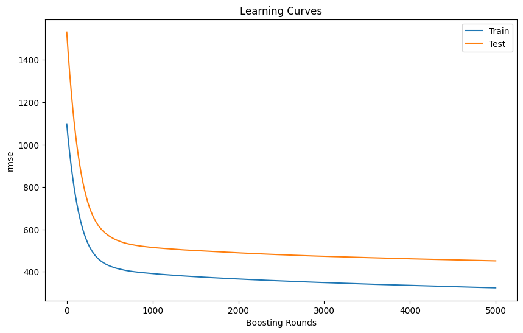
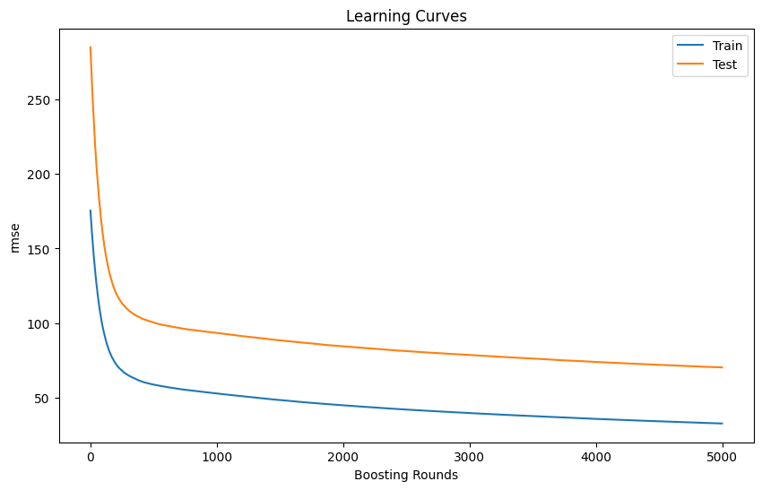
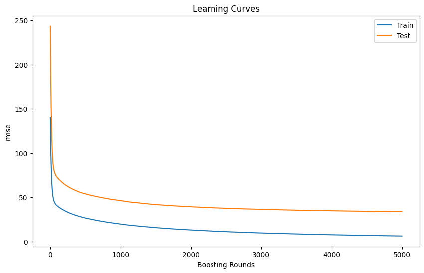

We discovered during our study that, as we already said, that the results of this algorithm, to find to best parameters were strongly correlated. Our submissions on kaggle were depending a lot of which test sets we choose. The thing is it was very though, and required a lot of time, to look for the best test set and and find the model with the best hyperparameters on it. 

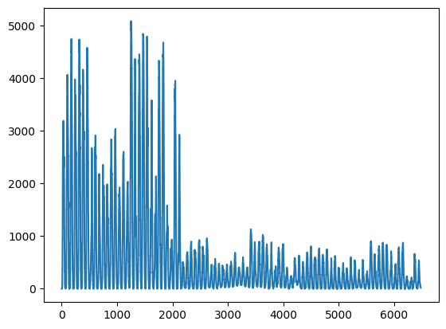

## 4. Areas for improvement

In this section, we are going to present the different areas of improvement we thought to do, but we did not had the time to implement them. However, we think that those areas would be interesting to think about, and could be interesting to develop, according to this project, or for a further one of us.

- Management of the training and test set:
    
    A first thing, which we already mentionned, and was a big challenge to upgrade, was the split between the training and testing set. We tryed many split and some of our upgrades which were an improvement on one test set, were not on an another. So it was really hard to deal with this. However, this is probably a common problem in machine learning, but we were still strugling with this. An idea, to fit the most possible the data we want to predict, were to adjust are testing set on the days which has similar values that the one we want to estimate. On the other hand, we wanted that our model must be the most general as we could so we did not do it at the first time. 

- Management of the observed/estimated set:

    A big issue that we faced with was how to take into consideration the difference of distribution between the observed and estimated set. The thing is, our biggest sets are the observed ones and on the other hand, we had to predict the values on estimated sets. Our only improvment in the submitted models, was to take some values in both training and testing sets. However, we could have improve that part by doing a lot of things but somes were requiring to much time to make it. For example, we thought about making kind of a GAN (generative adversarial network) to generate a convertissor from estimated values to observed ones, based on the `pv_measurement` values. However that kind of idea requires too much time to be very efficient so we did not focused much on it.

- Location combination:

    We experimented in our study to do a single model instead of three. It did not worked well but we figured out at the last moment that it could have been interesting to do 2, one for A and one for B and C because the hyperparameters of this two locations were very similar.

- Model combination:

    An idea that we had to improve the model, were to make some different models. We thought, as an intuitive way, that perhaps some models, with some hypermeters are better to predict on bad weather, and some, with other hyperparameters are better to predict on good weather. This is a lonely aspect, but we could take much more into consideration. Our idea would have be at first, with for example, two models which predicts a value each, $\hat{y_1}$ and $\hat{y_2}$, our final prediction would be a linear combination of those which makes our predicted value as: $$\hat{y} = \alpha * \hat{y_1} + \beta * \hat{y_2}$$
    Thus, this model could be also improved with a model which predict, based on the inputs, those coefficients $\alpha$ and $\beta$. The coefficients, would not be the same depending on the weather.

    We can notice that, that idea is not restricted on two, but we can had a lot more.

- Reduce the number of the features on our reshaped model:

    An other we thought about, was to reduce the number of features on our reshaped model based on the importance of them. Thus, we would have different models, one after the other, reducing the number of features, little by little.

- Trying other Machine Learning models:

    There are a lot more Machine Learning models existing nowdays but we only mainly focused on XGBoost, because a lack of time from us, spending to much time at first to find more difficult ways.

# Conclusion

In this part we are goning to summarize all we did and said concerning our study on this project, analyze and critic our methods, what worked well and failed for our futher projects and thus, make a conclusion.

In this report we tryied to present, the most possible, how we get through this project, the most possible as a chronological way. Firstly, we analysed the data which were given to us, trying to understand it and notice the most relevant information from it for the model we were going to devellop. Secondly, we presented one of our biggest research lead that we tryied to devellop at the begining of the project. We had really good hope about it at the beginning. However, the methods we had to devellop to get through it were to much complicated so it was not a success. We thus, re-start from scratch with a more classical approach which consisted in using already made-up models, such as Random Forest, XGBoost, AutoML and trying to improve it. This approach were really efficient at the beginning. When we started to use it, we get really satisfying results. Then, we tried more and more some pre-processing ideas, which were presented in this parts above. Thus, some ideas which thought were improvement were not working well when we tryed it. Actually, some thing were missing in that approach, it was to fit the hyperparamters with this. We already tryed earlier to find the best hyperparameters but the first approach was not successful. We get a lot of improvement in the method developped in [XGBoost hyper-parameters](#62-xgboost-hyper-parameters). Though, we developped this method quite late compared to the deadline of the project, so we could not develop it as we willing to; the time requires to develop it takes a lot of time because of the exponential complexity of the algorithm. So, we could not tryed all the improvement we thought about.

Actually, we are quite satisfiyed by our final result, concerning the short-time in which we developed the final model. However, we are quite disappointed because our first approach was not successful and we lost a lot of time on it. 